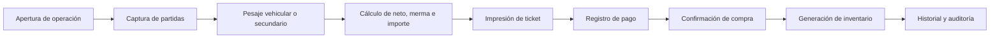

# Modelo de dominio inicial

ReTrace MX organiza su dominio alrededor de la operación de compra y su trazabilidad.

## Núcleo operativo

### PurchaseOperation

Entidad central del sistema. Representa la compra o ticket que agrupa partidas, pagos, impresión y control de cierre.

Campos clave:

- folio único,
- centro de acopio,
- cliente o generador,
- conductor y vehículo,
- estado operativo,
- estado de pago,
- estado de impresión,
- totales de peso, merma e importe.

### TicketItem

Partida asociada a una operación.

Puede capturarse por:

- diferencia vehicular,
- báscula secundaria directa,
- contingencia manual.

Incluye:

- material,
- peso bruto,
- tara,
- neto,
- merma,
- precio unitario,
- importe,
- estado,
- nota y auditoría.

### Payment

Pago asociado a una operación.

Controla:

- método,
- monto aplicado,
- monto recibido,
- cambio,
- referencia,
- cancelación,
- usuario que recibe.

### PrintLog

Bitácora de impresión y reimpresión del ticket.

Guarda:

- dispositivo impresor,
- copias,
- payload enviado,
- bandera de reimpresión,
- usuario,
- estado.

### InventoryMovement

Movimiento de inventario por material.

Se usa para:

- entrada de compra,
- ajustes posteriores,
- salidas por venta o consumo interno si aplica.

## Catálogos

- `MaterialFamily`
- `Material`
- `PriceList`
- `PriceListItem`
- `CommercialRole`
- `PersonOrCompany`
- `Vehicle`
- `Driver`
- `CollectionCenter`
- `Route`
- `Device`

## Logística y trazabilidad

- `WeighingSession`
- `ScaleReading`
- `CustodyEvent`
- `EvidenceFile`
- `AuditLog`
- `CollectionTrip`
- `Delivery`
- `GPSPosition`

## Reglas clave

1. La operación es la unidad de negocio principal.
2. Una operación puede tener varias partidas.
3. El peso neto nunca puede ser negativo.
4. El importe depende del peso neto y el precio unitario.
5. El inventario se materializa al pago.
6. La impresión no debe alterar el estado de negocio de la compra.
7. Toda acción sensible debe quedar auditada.

## Flujo base

## Alineación normativa

La estructura es compatible con:

- LGPGIR,
- NOM-161-SEMARNAT-2011,
- buenas prácticas de trazabilidad documental,
- enfoque de cadena de custodia y evidencia operativa.
